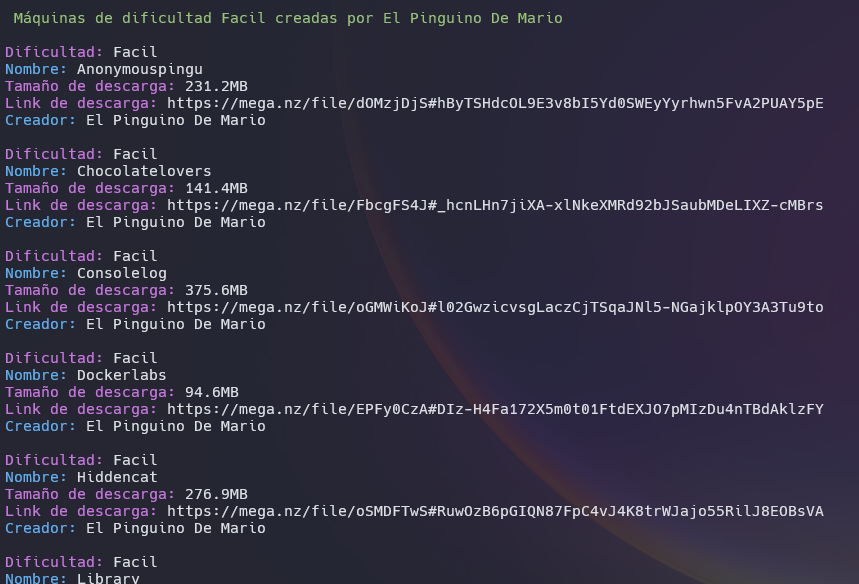
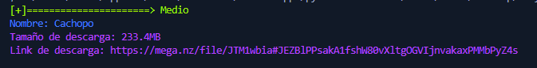
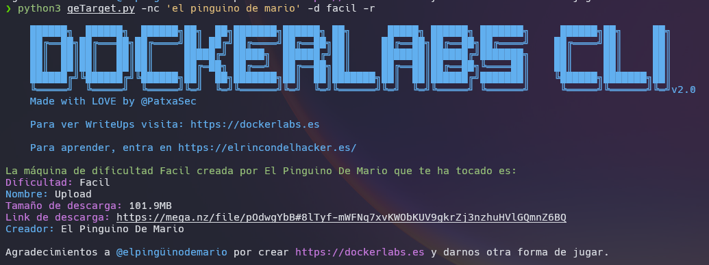

# DOCKERLABS CLI

PARA SU USO RECOMENDAMOS **KALI LINUX**. 

Dockerlabs es una plataforma de CTF con las máquinas creadas en docker. Fácil de iniciar, con gasto bajo de recursos, y facil de borrar. Plataforma creada por [@elpingüinodemario](https://github.com/Maalfer), y a quien tenemos que agradecer su pasión y esfuerzo.

# DockerLabs CLI
- v2.5 (Latest) 
    ### Añadido:
    - Modificado el output.
    - Opción a listar las máquinas que faltan por hacer.
    - Descarga de las máquinas.
## Instalación

```
git clone https://github.com/PatxaSec/DockerLabs.git
```
```
cd DockerLabs
```
```
pip3 install -r requirements.txt 
```
#### DISCLAIMER !!

Para que la funcionalidad de descarga de las maquinas funcione, es necesario descargar [geckodriver](https://github.com/mozilla/geckodriver). En caso de no descargarse, esa funcionalidad no existirá, pero la herramienta se podrá usar con el resto de sus funcionalidades.

La descarga la puedes realizar de forma manual con los siguientes comandos, o ejecutando el script [install_driver.sh](./install_driver.sh)

- Descargar.

```
curl -L https://github.com/mozilla/geckodriver/releases/download/v0.35.0/geckodriver-v0.35.0-linux64.tar.gz -o geckodriver.tar.gz
```

- Descomprimir.


```
tar -xzf geckodriver.tar.gz
```

Dar Permisos.


```
chmod +x geckodriver
```

- Mover a bin


```
sudo mv geckodriver /usr/bin
```

Exportar al path.


```
echo "export PATH=\$PATH:/usr/bin/geckodriver" >> ~/.profile
```

- Recargar perfil.


```
source ~/.profile
```

- Recargar la terminal.

---

# geTarget.py (Desarrollado en )

Probado en:  

Con este script puedes:
- Listar, ordenadas por dificultad, todas la máquinas disponibles junto con la memoria de descarga y su link.
- Listar Filtradas por la dificultad que escojas todas las máquinas disponibles en esa dificultad. `-d <dificultad>`
- Sacar una máquina aleatoria del listado completo. `-r`
- Sacar una máquina aleatoria de una dificultad concreta. `-r`+`-d <dificultad>`
- Guardar las máquinas ya hechas para que el output te avise, y al usar la opción random no te salgan. `-D <nombre de maquina>`
- Listar todas las maquinas ya hechas ordenadas por Dificultad. `-p`
- Buscar una máquina concreta por su nombre. `-n <nombre de máquina>`
- Buscar máquinas por creador. `-nc <nombre creador>`
- Sacar una máquina aleatoria de un creador concreto. `-r` + `-nc <nombre creador>`
- Listar máquinas ordenadas por creador. `-c`
- eliminar el color del output. `--no-colors`
- Listar máquinas no marcadas como Pwn3d: `-np`
- Descargar máquina concreta, buscandola por nombre o una aleatoria. `-r -w`, `-n <nombre> -w`, `-nc <mombre_creador> -r -w ` o `-d <dificultad> -r -w` (Necesario geckodriver)

## Uso

```
geTarget.py [-h] [-d DIFICULTAD] [-r] [-n NOMBRE] [-p] [-np] [-nb] [-D DONE] [-c] [-nc NOMBRE_CREADOR] [--no-colors] [-w]
```

## opciones
```
  -h, --help            show this help message and exit
  -d DIFICULTAD, --dificultad DIFICULTAD
                        Filtrar por dificultad. ['Muy Fácil', 'Fácil', 'Medio', 'Difícil']
  -r, --random          Máquina aleatoria.
  -n NOMBRE, --nombre NOMBRE
                        Buscar una máquina concreta.
  -p, --pwn3d           Listar todas las maquinas marcadas como hechas
  -np, --no-pwn3d       Listar todas las maquinas no marcadas como hechas
  -nb, --no-banner      Eliminar el banner del output.
  -D DONE, --Done DONE  Marcar una máquina como hecha.
  -c, --creador         Listar máquinas por creador.
  -nc NOMBRE_CREADOR, --nombre_creador NOMBRE_CREADOR
                        Buscar máquinas por nombre de creador.
  --no-colors           Eliminar colores del output.
  -w, --wget            Descargar máquina random o buscada por nombre

```

# Ejemplos

---
- Descarga de máquina.

[Video de ejemplo de Descarga.](ejemplos/Descarga.mp4)

```
geTarget.py -d facil -r -w
```


---
- Filtrado por creador y dificultad.

```
geTarget.py -nc 'el pinguino de mario' -d facil
```



---
- Búsqueda por nombre de máquina.

```
geTarget.py -n cachopo
```



---
- Sacar una máquina aleatoria filtrando por dificultad.

```
geTarget.py -d facil -r
```


