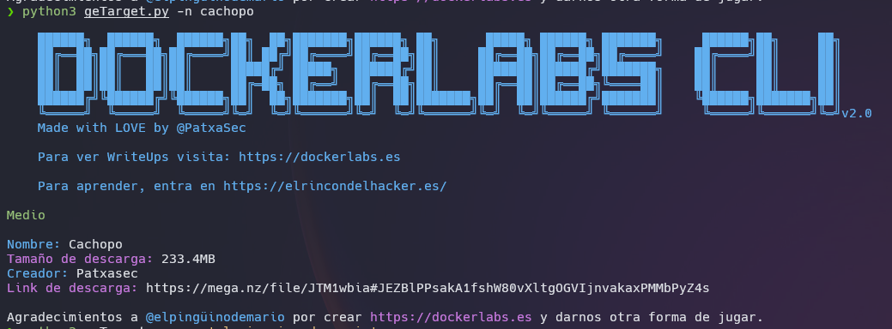

# DOCKERLABS CLI

Dockerlabs es una plataforma de CTF con las máquinas creadas en docker. Fácil de iniciar, con gasto bajo de recursos, y facil de borrar. Plataforma creada por [@elpingüinodemario](https://github.com/Maalfer), y a quien tenemos que agradecer su pasión y esfuerzo.

# DockerLabs CLI
- v2.0


## Instalación

```
git clone https://github.com/PatxaSec/DockerLabs.git
```
```
cd DockerLabs
```
```
pip3 install -r requirements.txt 
```


---

# geTarget.py (Desarrollado en )

Probado en:  

Con este script puedes:
- Listar, ordenadas por dificultad, todas la máquinas disponibles junto con la memoria de descarga y su link.
- Listar Filtradas por la dificultad que escojas todas las máquinas disponibles en esa dificultad. `-d <dificultad>`
- Sacar una máquina aleatoria del listado completo. `-r`
- Sacar una máquina aleatoria de una dificultad concreta. `-r`+`-d <dificultad>`
- Guardar las máquinas ya hechas para que el output te avise, y al usar la opción random no te salgan. `-D <nombre de maquina>`
- Listar todas las maquinas ya hechas ordenadas por Dificultad. `-p`
- Buscar una máquina concreta por su nombre. `-n <nombre de máquina>`
- Buscar máquinas por creador. `-nc <nombre creador>`
- Sacar una máquina aleatoria de un creador concreto. `-r` + `-nc <nombre creador>`
- Listar máquinas ordenadas por creador. `-c`
- eliminar el color del output. `--no-colors`

## Uso

```
geTarget.py [-h] [-d DIFICULTAD] [-r] [-n NOMBRE] [-p] [-nb] [-D DONE] [-c] [-nc NOMBRE_CREADOR] [--no-colors]
```

## opciones
```
 -h, --help            show this help message and exit
  -d DIFICULTAD, --dificultad DIFICULTAD
                        Filtrar por dificultad. ['Muy Fácil', 'Fácil', 'Medio', 'Difícil']
  -r, --random          Máquina aleatoria.
  -n NOMBRE, --nombre NOMBRE
                        Buscar una máquina concreta.
  -p, --pwn3d           Listar todas las maquinas marcadas como hechas
  -nb, --no-banner      Eliminar el banner del output.
  -D DONE, --Done DONE  Marcar una máquina como hecha.
  -c, --creador         Listar máquinas por creador.
  -nc NOMBRE_CREADOR, --nombre_creador NOMBRE_CREADOR
                        Buscar máquinas por nombre de creador.
  --no-colors           Eliminar colores del output.

```

# Ejemplos

---
- Filtrado por creador y dificultad.

```
geTarget.py -nc 'el pinguino de mario' -d facil
```


---
- Búsqueda por nombre de máquina.

```
geTarget.py -n cachopo
```



---
- Sacar una máquina aleatoria filtrando por dificultad.

```
geTarget.py -d facil -r
```


